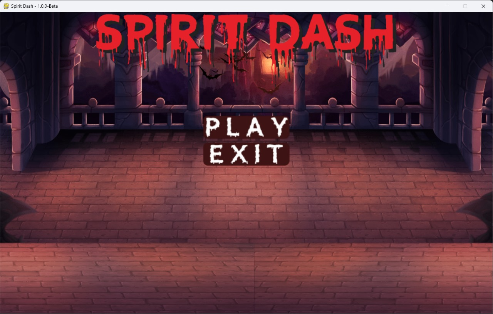
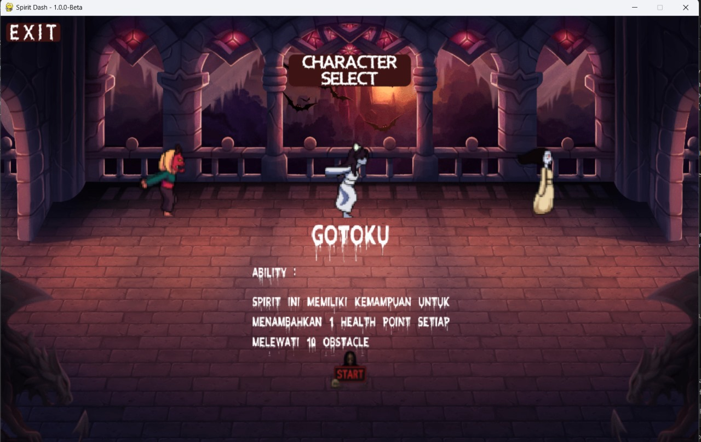
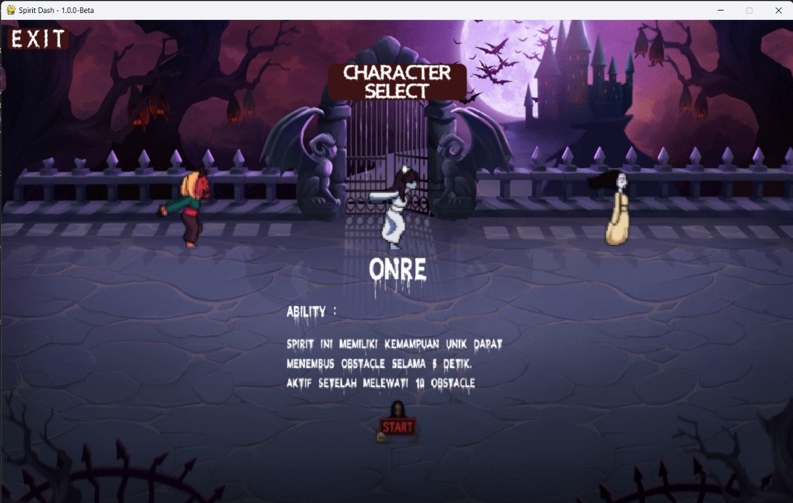
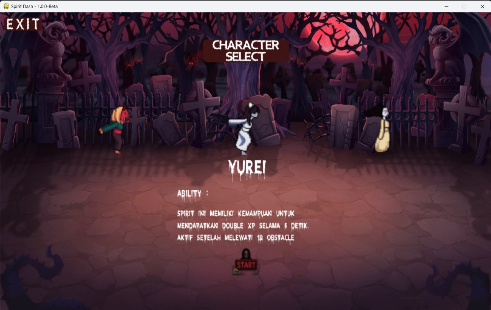
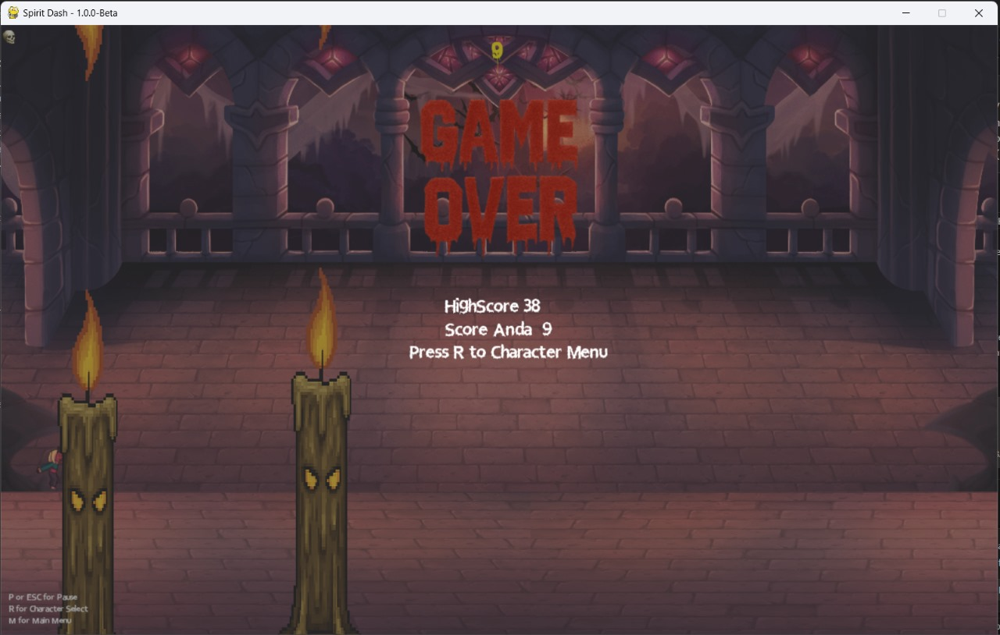
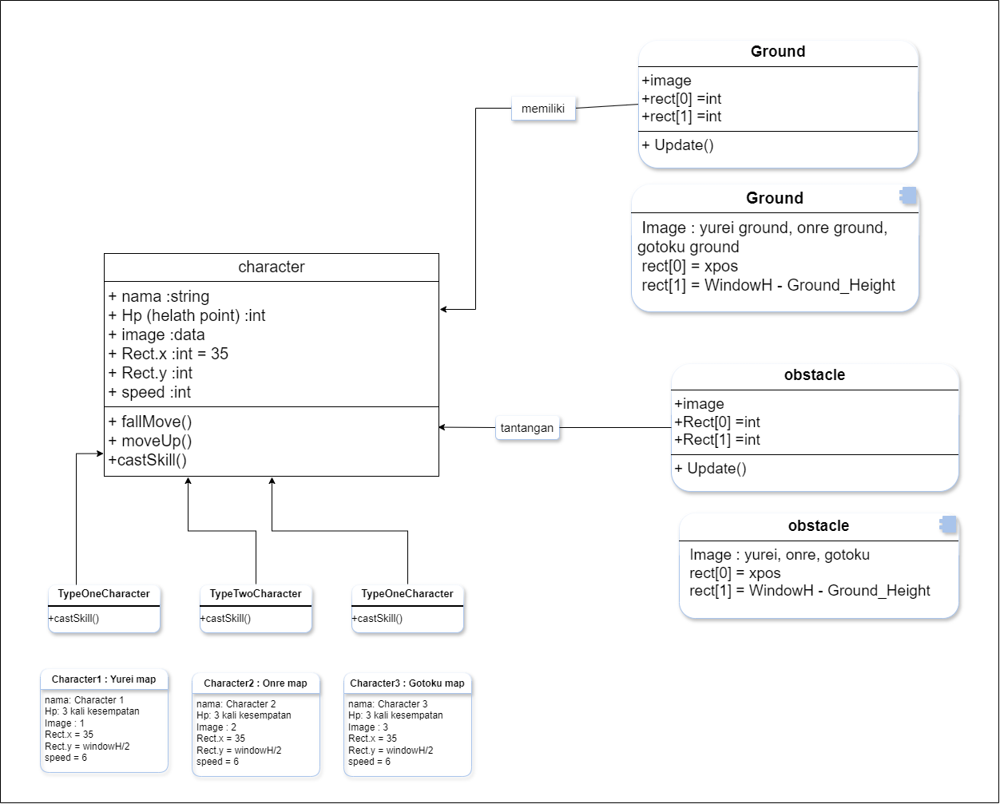

# SPIRIT DASH
## Deskripsi Proyek

**"SPIRIT DASH"** - Spirit Dash adalah sebuah game aksi 2D bertema supranatural yang terinspirasi dari gameplay sederhana dan adiktif ala Flappy Bird, namun hadir dengan mekanisme yang lebih unik, strategis, dan menantang. Dalam game ini, pemain mengendalikan karakter hantu yang harus terus melaju melewati berbagai rintangan yang semakin sulit seiring waktu. Tujuan utama dari game ini adalah membantu karakter hantu terus melaju dan melewati berbagai rintangan sebanyak mungkin untuk mengumpulkan poin tertinggi, sekaligus menjaga agar karakter tetap bertahan hidup. Game ini mengusung tema supranatural dan horor ringan, dengan latar lingkungan yang gelap, misterius, dan dipenuhi suasana mistis.
Pemain diberikan tiga kesempatan (nyawa). Jika karakter gagal menghindari rintangan sebanyak tiga kali, maka permainan akan berakhir dan skor akhir akan ditampilkan.


---

## Library, Framework & Alat yang Digunakan

- [Python](https://www.python.org/downloads/)
- [Pygame](https://www.pygame.org/)

---

## Cara Bermain
Buka Spirit Dash
Pilih menu "Mulai"
Pilih Character yang ingin digunakan
Klik Button Start
Gunakan Tombol Spasi, atau klik kiri pada mouse
Gunakan Tombol P atau ESC untuk menghentikan game sementara

---

## Screnshoot







## Cara Menjalankan
1. Clone Repository ini:
   ```bash
   git clone https://github.com/rapstronaut/SpiritDash.git
   ```
2. Pindah ke direktori proyek:
   ```bash
   cd SpiritDash
   ```
3. Install pygame:
   ```bash
   pip install pygame
   ```
4. Jalankan Gamenya:
   ```bash
   python main.py
   ```
---

## UML Class Diagram



---

## Kontributor

| Nama                      | NIM         | Kontribusi                           |
|---------------------------|-------------|--------------------------------------|
| Muhamad Rafi Ilham        | 123140173   | Programmer, Asset Handler            |
| Devina Kartika            | 123140036   | Slide Designer, Report Contributor   |
| Khairul Rijal Syauqi      | 123140143   | Programmer, Intregrator              |
| Arta Eka Yuli R           | 123140209   | Video Editor, Report Contributor     |
| Diva Amelia Saputri       | 122140212   | System Designer, Report Contributor  |     

---

**Referensi Game:**  
- [Flappy Bird](#)

---

